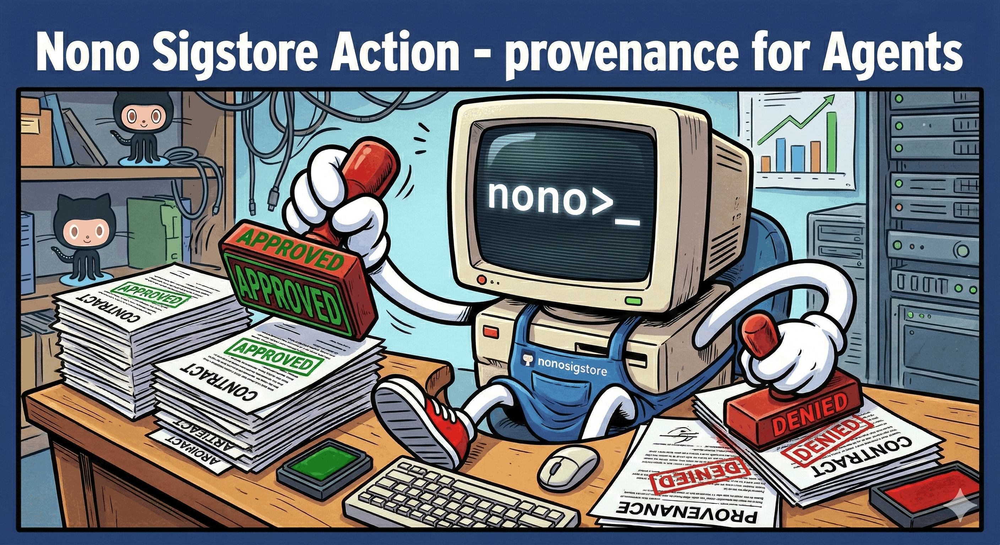

<p align="center">
  
</p>

<p align="center">
  <strong>Cryptographic provenance for AI agent instruction files</strong><br>
  Sign SKILLS.md, CLAUDE.md, AGENT.md and other instruction files with <a href="https://sigstore.dev">Sigstore</a> keyless attestation — no keys to manage, no secrets to rotate.
</p>

<p align="center">
  <a href="#quick-start">Quick Start</a> |
  <a href="#how-it-works">How It Works</a> |
  <a href="#inputs">Inputs</a> |
  <a href="#verification">Verification</a> |
  <a href="https://github.com/always-further/nono">nono CLI</a>
</p>

---

## Why?

AI agents read instruction files to determine what they can do. If those files are tampered with, the agent follows malicious instructions. This action creates a cryptographic chain of trust: every instruction file gets signed in CI, and nono verifies those signatures before the agent can read them.

The result is a **Sigstore bundle** containing a DSSE envelope with an in-toto statement, a Fulcio certificate (binding GitHub Actions OIDC identity to the signature), and a Rekor transparency log inclusion proof. No private keys involved — identity is derived from the CI workflow itself.

## Quick Start

```yaml
name: Sign instruction files
on:
  push:
    branches: [main]
    paths: ['SKILLS*', 'CLAUDE*', 'AGENT*', '.claude/**/*.md']

permissions:
  id-token: write
  contents: write

jobs:
  sign:
    runs-on: ubuntu-latest
    steps:
      - uses: actions/checkout@v4
      - uses: always-further/nono-skill-sign-action@v1
```

That's it. This signs all instruction files matching nono's default patterns, commits the `.bundle` sidecars, and verifies the signatures as a smoke test.

## How It Works

1. Installs the [nono CLI](https://github.com/always-further/nono) from GitHub releases
2. Signs instruction files using `nono trust sign --keyless`
3. GitHub Actions OIDC provides the identity token automatically
4. Fulcio issues a short-lived certificate binding the OIDC claims (repository, workflow, ref) to an ephemeral signing key
5. The signature is submitted to Rekor for transparency logging
6. The resulting bundle contains everything needed for offline verification

## Multi-Subject vs Per-File Bundles

By default, all specified files are signed together into a single `.nono-trust.bundle`. One signature covers the entire set — modify any file and the whole bundle is invalidated. This is the recommended approach for related instruction files.

| Mode | Bundle Output | Use Case |
|------|---------------|----------|
| **Multi-subject** (default) | `.nono-trust.bundle` | Sign related files together. Atomic verification. Any change invalidates the bundle. |
| **Per-file** (`per-file: true`) | `<file>.bundle` for each | Independent signatures. Files can be updated and verified separately. |

## Examples

### Upload bundles as workflow artifacts

```yaml
- uses: always-further/nono-skill-sign-action@v1
  with:
    commit: "false"
    upload-artifacts: "true"
```

### Sign specific files together

```yaml
- uses: always-further/nono-skill-sign-action@v1
  with:
    files: "SKILLS.md CLAUDE.md config/settings.json"
```

### Sign files separately

```yaml
- uses: always-further/nono-skill-sign-action@v1
  with:
    files: "SKILLS.md CLAUDE.md"
    per-file: "true"
```

### Pin a specific nono version

```yaml
- uses: always-further/nono-skill-sign-action@v1
  with:
    version: "v0.6.0-alpha.3"
```

### Custom trust policy for verification

```yaml
- uses: always-further/nono-skill-sign-action@v1
  with:
    trust-policy: "trust-policy.json"
```

## Inputs

| Input | Default | Description |
|-------|---------|-------------|
| `version` | `latest` | nono CLI version to install |
| `files` | _(empty)_ | Whitespace-separated list of files to sign. Empty = `--all` (matches instruction patterns) |
| `per-file` | `false` | Sign each file separately instead of a single multi-subject bundle |
| `commit` | `true` | Commit bundle files back to the repository |
| `upload-artifacts` | `false` | Upload bundle files as workflow artifacts |
| `verify` | `true` | Run verification after signing |
| `trust-policy` | _(empty)_ | Path to `trust-policy.json` for verification |
| `working-directory` | `.` | Working directory for signing |
| `commit-message` | `chore: update instruction file attestation bundles [skip ci]` | Commit message |

## Requirements

The workflow must have `id-token: write` permission for Sigstore keyless signing. If `commit: true` (the default), it also needs `contents: write`.

```yaml
permissions:
  id-token: write
  contents: write
```

## Verification

Consumers verify bundles using a `trust-policy.json` that defines trusted publishers:

```json
{
  "version": 1,
  "instruction_patterns": ["SKILLS*", "CLAUDE*", "AGENT*", ".claude/**/*.md"],
  "publishers": [
    {
      "name": "my-org CI",
      "issuer": "https://token.actions.githubusercontent.com",
      "repository": "my-org/my-repo",
      "workflow": ".github/workflows/sign-instruction-files.yml",
      "ref_pattern": "refs/heads/main"
    }
  ],
  "blocklist": { "digests": [] },
  "enforcement": "deny"
}
```

Verify locally:

```bash
nono trust verify --policy trust-policy.json --all
```

Or enforce at runtime — nono's pre-exec scan verifies all instruction files before the agent can read them:

```bash
nono run --profile claude-code -- claude
```

## Bundle Output Options

| Option | Use Case |
|--------|----------|
| `commit: true` (default) | Bundles live alongside files in version control. Consumers get them on `git clone`. |
| `upload-artifacts: true` | Bundles available as downloadable workflow artifacts. Useful for release pipelines. |
| Both | Commit for development, artifacts for release automation. |

## Companion Artifacts

SKILL files often reference companion artifacts (scripts, configs, data files). Use multi-subject signing to attest them together:

```yaml
- uses: always-further/nono-skill-sign-action@v1
  with:
    files: "SKILLS.md lib/helper.py config/settings.json"
```

This produces a single `.nono-trust.bundle` that attests all three files. If any file is modified, the entire bundle becomes invalid, ensuring the agent only receives a consistent, verified set of files.

## License

Apache-2.0
